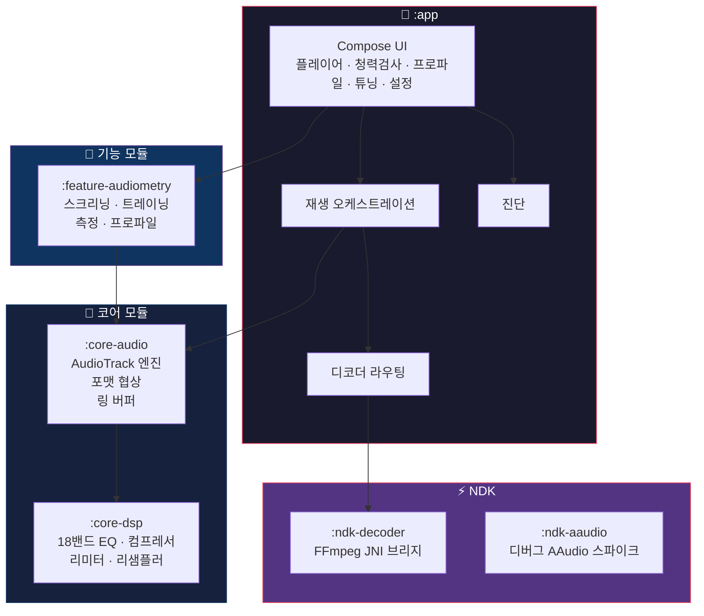
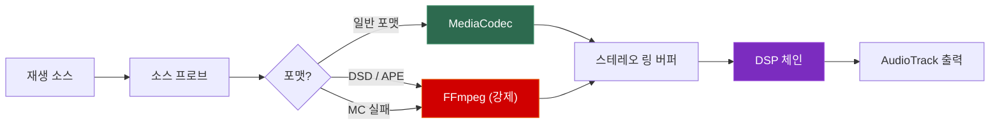

<div align="center">

# 🎧 HearTune

**청력 프로파일 기반 튜닝 & 비의료용 스크리닝을 갖춘 Android 오디오 플레이어**

[](https://kotlinlang.org)
[](https://developer.android.com/jetpack/compose)
[](https://developer.android.com/about/versions/oreo)
[](https://developer.android.com/about/versions/15)
[](https://developer.android.com/ndk)
[](./LICENSE)

---

*청력 인식 DSP 보정, 하이브리드 디코더 라우팅, 소비자용 청력 스크리닝을 통한 개인화 오디오 경험*

</div>

---

## 📋 목차

- [개요](#-개요)
- [면책 조항](#-면책-조항)
- [주요 기능](#-주요-기능)
- [아키텍처](#-아키텍처)
- [모듈 구조](#-모듈-구조)
- [기술 스택](#-기술-스택)
- [시작하기](#-시작하기)
- [청력 테스트 설계](#-청력-테스트-설계)
- [DSP 파이프라인](#-dsp-파이프라인)
- [디코더 & 재생](#-디코더--재생)
- [테스트 & 검증](#-테스트--검증)
- [스크립트 & 도구](#-스크립트--도구)
- [알려진 제한사항](#-알려진-제한사항)
- [로드맵](#-로드맵)
- [문서](#-문서)
- [기여 가이드](#기여-가이드)

---

## 🔍 개요

HearTune은 **앱 내 청력 테스트**, **청력 프로파일 저장**, **프로파일 기반 실시간 DSP 재생 보정**을 하나의 앱에서 제공하는 Android 애플리케이션입니다. 사용자는 자신의 청력 경향을 빠르게 스크리닝하고, 개인화 오디오 프로파일을 생성하며, 음악 재생 시 보정 커브를 적용할 수 있습니다.

> [!IMPORTANT]
> 이 프로젝트는 현재 **엔지니어링 중심 개발 단계**(`v0.1.0`)입니다. 핵심 플로우는 기능적으로 완성되어 있지만, UX는 소비자 배포보다 개발 반복에 최적화되어 있습니다.

---

## ⚠️ 면책 조항

> [!CAUTION]
> **이 앱은 의료기기가 아닙니다.** HearTune의 청력 테스트 기능은 명시적으로 비의료용입니다.

| 해당 사항 | 비해당 사항 |
|:---|:---|
| ✅ 소비자용 청력 스크리닝 | ❌ 진단용 의료기기 |
| ✅ 주파수별 청취 경향 추정 | ❌ 임상 역치 검사 |
| ✅ 튜닝 프로파일 shape 추론 | ❌ 치료 또는 처방 도구 |
| ✅ 앱 내부 `dBFS` 기반 pseudo-threshold | ❌ 보정된 `dB HL` 측정 |
| ✅ 신뢰성 검증된 빠른 평가 | ❌ 기기/헤드폰 절대 캘리브레이션 |

결과값은 **앱 내부 `dBFS` 공간의 pseudo-threshold**이며, 보정된 청력 수치가 아닙니다. 의료적 판단에 사용하지 마십시오.

---

## ✨ 주요 기능

### 🎵 오디오 플레이어
- **하이브리드 디코더 라우팅**을 통한 다중 포맷 재생 (MediaCodec + FFmpeg)
- Lossy, Lossless, DSD, APE, ALAC, FLAC, WAV, raw PCM 지원
- 루프 재생, 소스 선택, 포맷 진단
- 프로파일 기반 **DSP A/B 비교**

### 👂 청력 테스트
- **Quick Screening** — catch trial 포함 빠른 shape 추정
- **Training** — 측정 전 2AFC 친숙화 단계
- **Measurement** — 9주파수 staircase 기반 pseudo-threshold 추정
- 헤드폰 확인 강제, 출력 경로 변경 시 자동 일시정지, 세션 재개

### 🎛️ DSP & 튜닝
- 청력 프로파일 보정 지원 **18밴드 파라메트릭 EQ**
- 10단계 DSP 체인: EQ → Dynamic EQ → De-esser → Frequency Lowering → Multiband Compression → Wideband DRC → AGC → Noise Gate → Binaural Balance → Limiter
- 프로세서별 컨트롤 및 Proto DataStore 기반 **영속적 상태 관리**
- 수동 및 프로파일 기반 보정 모드

### 📊 진단
- Underrun / Underflow 추적
- 렌더 블록, CPU, 쓰기 타이밍 백분위 (P95/P99)
- 디코더 백엔드 및 출력 포맷 투명성
- 60초 / 10분 Soak 안정성 테스트
- ADB 기반 자가 테스트 진입

---

## 🏗️ 아키텍처



---

## 📦 모듈 구조

| 모듈 | 타입 | 설명 |
|:---|:---|:---|
| **`:app`** | Application | Compose UI, 재생 오케스트레이션, 디코더 선택, 튜닝 상태 연결, 진단 |
| **`:core-audio`** | Android Library | `AudioTrack` 출력 엔진, 포맷 협상, PCM 양자화, 링 버퍼, WAV/PCM 리더 |
| **`:core-dsp`** | JVM Library | 정식(canonical) DSP: 18밴드 EQ, 컴프레서, 리미터, 리샘플러, 튜닝 프로세서 |
| **`:feature-audiometry`** | Android Library | 청력 테스트 UI 및 로직, 세션 관리, 프로파일 저장, 튜닝 Proto DataStore |
| **`:ndk-decoder`** | Android Library (NDK) | FFmpeg JNI 브리지, 하이브리드 재생용 네이티브 디코더 (arm64) |
| **`:ndk-aaudio`** | Android Library (NDK) | 디버그 전용 네이티브 AAudio 실험 모듈 |

### 의존성 그래프

```
:app
├── :core-dsp
├── :core-audio
├── :feature-audiometry → :core-audio
├── :ndk-decoder
└── :ndk-aaudio (디버그 전용)
```

---

## 🛠️ 기술 스택

<table>
<tr><th>분류</th><th>기술</th><th>버전</th></tr>
<tr><td>언어</td><td>Kotlin</td><td><code>2.0.21</code></td></tr>
<tr><td>UI 프레임워크</td><td>Jetpack Compose (Material 3)</td><td>BOM <code>2024.10.01</code></td></tr>
<tr><td>빌드 시스템</td><td>Gradle (Kotlin DSL)</td><td>AGP <code>8.7.3</code></td></tr>
<tr><td>JDK 툴체인</td><td>Java / Kotlin</td><td><code>21</code></td></tr>
<tr><td>최소 SDK</td><td>Android</td><td>API <code>26</code> (Oreo)</td></tr>
<tr><td>대상 / 컴파일 SDK</td><td>Android</td><td>API <code>35</code></td></tr>
<tr><td>NDK</td><td>Android NDK</td><td><code>26.3.11579264</code></td></tr>
<tr><td>CMake</td><td>네이티브 빌드</td><td><code>3.22.1</code></td></tr>
<tr><td>영속성</td><td>Proto DataStore</td><td><code>1.1.1</code></td></tr>
<tr><td>직렬화</td><td>Protobuf Java Lite</td><td><code>3.25.5</code></td></tr>
<tr><td>내비게이션</td><td>Compose Navigation</td><td><code>2.8.3</code></td></tr>
<tr><td>린트</td><td>ktlint (Gradle 플러그인)</td><td><code>12.1.1</code></td></tr>
<tr><td>네이티브 디코더</td><td>FFmpeg (arm64-v8a)</td><td>커스텀 빌드</td></tr>
</table>

---

## 🚀 시작하기

### 전제 조건

| 요구사항 | 상세 |
|:---|:---|
| **JDK** | 21 이상 |
| **Android SDK** | 플랫폼 35 설치 |
| **Android NDK** | `26.3.11579264` |
| **CMake** | `3.22.1` |
| **디바이스/에뮬레이터** | API 26+ (FFmpeg 사용 시 arm64 권장) |

### 빌드 & 설치

```powershell
# 저장소 클론
git clone https://github.com/coreline-ai/kotlin_audio_heartune.git
cd kotlin_audio_heartune

# 디버그 APK 빌드 및 설치
.\gradlew.bat :app:installDebug
```

### 실행

```powershell
adb shell am start -W -n com.heartune.app/.MainActivity
```

### 테스트 실행

```powershell
# 핵심 유닛 테스트
.\gradlew.bat :core-dsp:test :core-audio:test :feature-audiometry:testDebugUnitTest

# 전체 유닛 테스트
.\gradlew.bat :core-audio:test :core-dsp:test :feature-audiometry:test :app:testDebugUnitTest

# 린트 검사
.\gradlew.bat check
```

---

## 👂 청력 테스트 설계

### 설계 철학

HearTune의 스크리닝은 모든 주파수를 균일하게 검사하지 않습니다. **가장자리 대역 신뢰도**와 **신뢰성 검출**을 최우선으로 합니다:

| 전략 | 목적 |
|:---|:---|
| **중역대 최소 샘플링** | 대부분의 사용자가 안정적으로 듣는 대역 — 기준점 확인만 |
| **가장자리 대역 강조** | 저역/초고역은 개인차와 연령 변수가 큼 |
| **무음 catch trial** | "들린 것 같다"는 허위 반응 검출 |
| **범위 밖 probe** | 상상/기대 편향 검출 |
| **가장자리 대역 반복** | 경계 주파수에서의 일관성 확인 |

### 테스트 모드

<details>
<summary><b>Quick Screening</b> — 빠른 shape 추정 (귀당 약 1~2분)</summary>

- 귀당 고정 trial 수
- 무음 catch trial 및 범위 밖 probe 포함
- `1000 Hz`, `4000 Hz` 앵커 사용
- 결과: **9점 pseudo-threshold 맵**
- 트레이드오프: 균일한 주파수 커버리지보다 속도 우선

</details>

<details>
<summary><b>Training</b> — 2AFC 친숙화 단계</summary>

- `1 kHz` 기준 주파수
- 이중 대안 강제 선택 (2AFC)
- "첫 번째 / 두 번째" 응답 방식에 대한 사용자 친숙도 향상
- 정식 측정 전 사전 단계

</details>

<details>
<summary><b>Measurement</b> — Staircase 기반 추정</summary>

- **9개 주파수**: `250, 500, 1000, 2000, 3000, 4000, 6000, 8000, 12500 Hz`
- **고정 순서**: `1000 → 2000 → 4000 → 8000 → 500 → 250 → 3000 → 6000 → 12500`
- 적응적 스텝의 2AFC staircase (`10 dB` 초기 → `5 dB` 정밀화)
- 결과: 좌/우 9점 오디오그램 맵

</details>

### 신호 생성 파라미터

| 파라미터 | 값 |
|:---|:---|
| 샘플 레이트 | `48 kHz` |
| 톤 생성 | 직접 사인파 합성 |
| 채널 모드 | 단귀 (시행당 좌 또는 우) |
| 램프 | raised-cosine onset/offset (클릭 감소) |

---

## 🎛️ DSP 파이프라인

### 체인 토폴로지 (처리 순서)

```
입력 신호
  │
  ├─ 1. EQ (18밴드 파라메트릭)
  ├─ 2. Dynamic EQ
  ├─ 3. De-esser
  ├─ 4. Frequency Lowering
  ├─ 5. Multiband Compression
  ├─ 6. Wideband DRC
  ├─ 7. AGC
  ├─ 8. Noise Gate
  ├─ 9. Binaural Balance / Crossfeed
  └─ 10. Limiter
  │
  ▼
출력 신호
```

### 보정 매핑 흐름

```
9점 오디오그램 → 기준 역치 선택
              → 상대적 손실 shape 도출
              → 프리셋 기반 게인 스케일링
              → 로그 주파수 보간 (→ 18밴드 EQ 그리드)
              → 선택적 스무딩
              → EQ 보정 적용
```

<details>
<summary><b>18밴드 EQ 중심 주파수</b></summary>

`250` · `315` · `400` · `500` · `630` · `800` · `1000` · `1250` · `1600` · `2000` · `2500` · `3150` · `4000` · `5000` · `6300` · `8000` · `10000` · `12500` Hz

</details>

> [!NOTE]
> 이것은 **상대적 보정 모델**이며, 임상적 피팅이 아닙니다. 프로파일 기반 보정은 추정된 청력 shape에 따라 상대적 주파수 밸런스를 조정합니다.

---

## 🔊 디코더 & 재생

### 하이브리드 디코더 아키텍처



| 경로 | 조건 | 비고 |
|:---|:---|:---|
| **MediaCodec 우선** | 대부분의 포맷에 대해 기본 | 표준 Android 디코더 |
| **FFmpeg 폴백** | 프로브/초기화 실패, MIME 미지원 | 자동 폴백 |
| **FFmpeg 강제** | DSD (`.dsf`, `.dff`), APE (`.ape`) | 정책 기반 라우팅 |

### 출력 포맷 협상

| 소스 유형 | 요청 출력 | 폴백 |
|:---|:---|:---|
| Lossy | PCM16 | — |
| Lossless | 소스 기반 비트 깊이 유지 | `96 kHz` → `48 kHz` |
| 고레이트 오버로드 | 단계적 다운 폴백 | 최종: `48 kHz` PCM16 |

---

## 🧪 테스트 & 검증

### 테스트 커버리지 요약

| 모듈 | 유닛 테스트 | 인스트루멘테이션 |
|:---|:---:|:---:|
| `:app` | 3개 파일 | 30개 파일 |
| `:core-audio` | 7개 파일 | — |
| `:core-dsp` | 16개 파일 | — |
| `:feature-audiometry` | 12개 파일 | 7개 파일 |

### 빠른 명령어

```powershell
# 핵심 유닛 테스트
.\gradlew.bat :core-dsp:test :core-audio:test :feature-audiometry:testDebugUnitTest

# 인스트루멘테이션 스위트 (디바이스 필요)
.\scripts\run_instrumentation_suite.ps1 -Serial <디바이스-시리얼>

# 하이브리드 디코더 검증 (디바이스 필요)
.\scripts\run_hybrid_decoder_validation.ps1 -Serial <디바이스-시리얼>
```

### 디코더 테스트 에셋

| 파일 | 상태 |
|:---|:---|
| `test_24bit_96k.flac` | 필수 |
| `test_24bit_96k_alac.m4a` | 필수 |
| `test_short.dsf` | 필수 |
| `test_short.ape` | 선택 |
| `test_short.wma` | 선택 |

### 자가 테스트 진입 (ADB)

```powershell
# 오디오 자가 테스트 모드
adb shell am start -n com.heartune.app/.MainActivity --ez self_test_audio true

# 진단용 underrun 유발
adb shell am start -n com.heartune.app/.MainActivity --ez induce_underrun true
```

---

## 📜 스크립트 & 도구

| 스크립트 | 용도 |
|:---|:---|
| `scripts/auto_build_install_run.ps1` | 자동 빌드 → 설치 → 실행 |
| `scripts/run_instrumentation_suite.ps1` | 그룹화된 인스트루멘테이션 테스트 실행 |
| `scripts/run_hybrid_decoder_validation.ps1` | 디코더 경로 검증 |
| `scripts/run_device_measurements.ps1` | 디바이스 성능 측정 |
| `scripts/apply_measurement_to_docs.ps1` | 측정 결과를 문서에 반영 |
| `scripts/ffmpeg/build_android_arm64.ps1` | FFmpeg arm64 공유 라이브러리 빌드 (Windows) |
| `scripts/ffmpeg/build_android_arm64.sh` | FFmpeg arm64 공유 라이브러리 빌드 (Linux/macOS) |

---

## ⚡ 알려진 제한사항

> [!WARNING]
> 현재 아키텍처의 알려진 제약사항입니다.

- 🔇 **절대 음압(SPL) 캘리브레이션 없음** — 결과는 앱 내부 상대값
- 🎧 **헤드폰별 보정 테이블 없음** — 기기/헤드폰 주파수 응답 미보정
- 📐 **가장자리 대역 편향** — Quick Screening은 의도적으로 경계 주파수에 집중
- 🏗️ **대형 파일** — `PlayerSession`, `PlayerScreen`, `AudiometryScreen` 분할 필요
- 📦 **arm64 전용 FFmpeg** — 네이티브 디코더 패키징이 현재 단일 ABI
- 🔄 **백그라운드 재생 미지원** — `MediaBrowserService` 구현 없음
- 🌐 **클라우드 동기화 없음** — 완전 오프라인, 백엔드 연동 없음
- 🔗 **모듈 간 결합** — `:feature-audiometry`의 `TuningStateRepository`를 `:app`이 공유 인프라로 사용

---

## 🗺️ 로드맵

### 🔴 높은 우선순위

- [ ] `PlayerSession`을 관심사별 클래스로 분리
- [ ] `PlayerScreen` 분리 (전송 / 진단 / 소스 / 보정)
- [ ] `AudiometryScreen` 스테이지 로직 분리
- [ ] Kotlin 소스의 mojibake 사용자 노출 문자열 정리
- [ ] `:app`과 `:feature-audiometry` 간 인프라 결합 감소

### 🟡 중간 우선순위

- [ ] 루프 엣지 케이스에 대한 하이브리드 디코더 검증 강화
- [ ] FFmpeg 패키징의 장기 ABI 정책 결정
- [ ] 소비자 UX와 진단 화면의 명확한 분리

### 🔵 보류 (필요 시 진행)

- [ ] 네이티브 DSP 포팅 (Kotlin 경로 병목이 측정 가능한 경우에만)
- [ ] 백그라운드 재생 / 미디어 서비스 아키텍처
- [ ] 릴리스 수준 디바이스 캘리브레이션 프레임워크
- [ ] 클라우드 동기화 / 백엔드 연동
- [ ] 멀티 ABI FFmpeg 패키징

---

## 📚 문서

| 문서 | 설명 |
|:---|:---|
| [`docs/README.md`](docs/README.md) | 문서 인덱스 및 통합 노트 |
| [`docs/PRD.md`](docs/PRD.md) | 제품 요구사항 및 사용자 플로우 |
| [`docs/TRD.md`](docs/TRD.md) | 기술 레퍼런스 및 아키텍처 |
| [`docs/TASKS.md`](docs/TASKS.md) | 구현 현황 및 로드맵 |
| [`docs/QUICK_SCREENING_LEVEL_POLICY.md`](docs/QUICK_SCREENING_LEVEL_POLICY.md) | 테스트 탭의 preview / quick / measurement 레벨 정책 |
| [`docs/VERIFICATION_PLAN.md`](docs/VERIFICATION_PLAN.md) | 검증 전략, 명령어, 기록된 결과 |
| [`docs/NATIVE_DECODER.md`](docs/NATIVE_DECODER.md) | FFmpeg 빌드 가이드, 디코더 검증, NDK 노트 |
| [`AGENTS.md`](AGENTS.md) | 프로젝트 개발 규칙 |

---

## 기여 가이드

1. [`AGENTS.md`](AGENTS.md)의 규칙을 따르세요
2. 제출 전 `.\gradlew.bat check`를 실행하세요 (`ktlint` 포함)
3. 변경 사항에 맞는 가장 좁은 테스트 범위를 대상으로 하세요
4. 구현 상태가 바뀌면 `docs/TASKS.md`를 업데이트하세요
5. 검증 플로우가 바뀌면 `docs/VERIFICATION_PLAN.md`를 업데이트하세요

---

<div align="center">

**Built with** ❤️ **by [Coreline AI](https://github.com/coreline-ai)**

*Kotlin · Jetpack Compose · FFmpeg · Proto DataStore*

</div>
